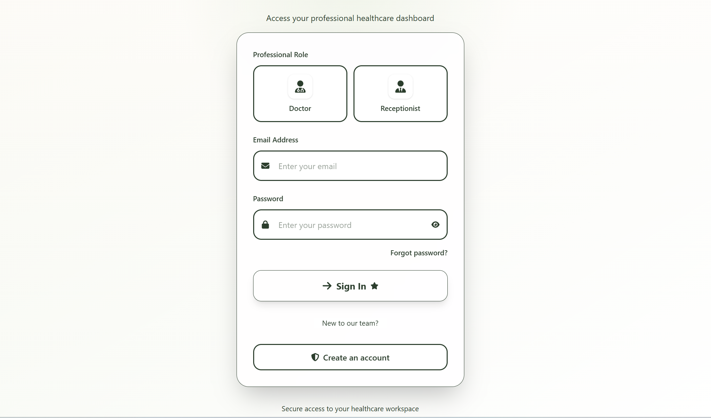
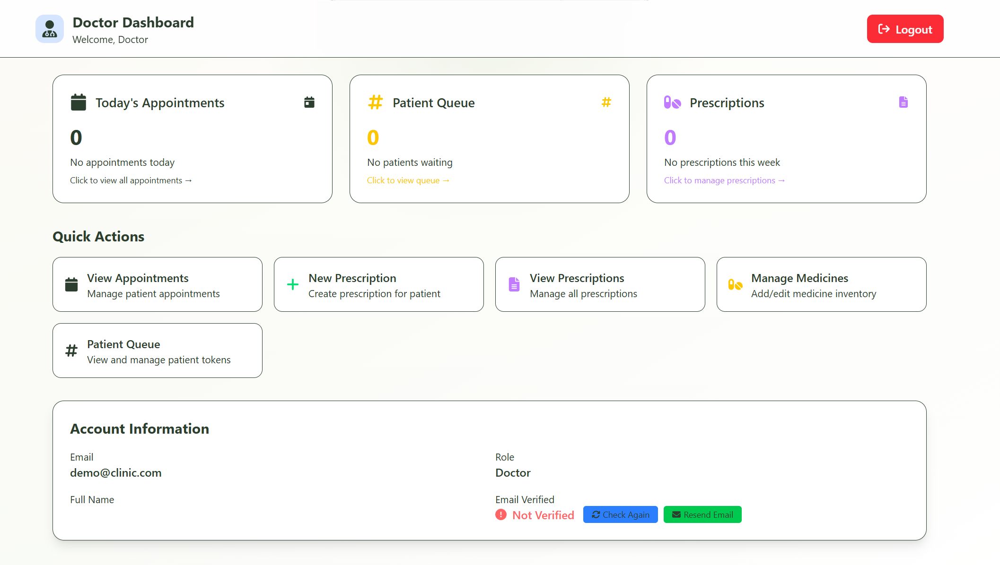
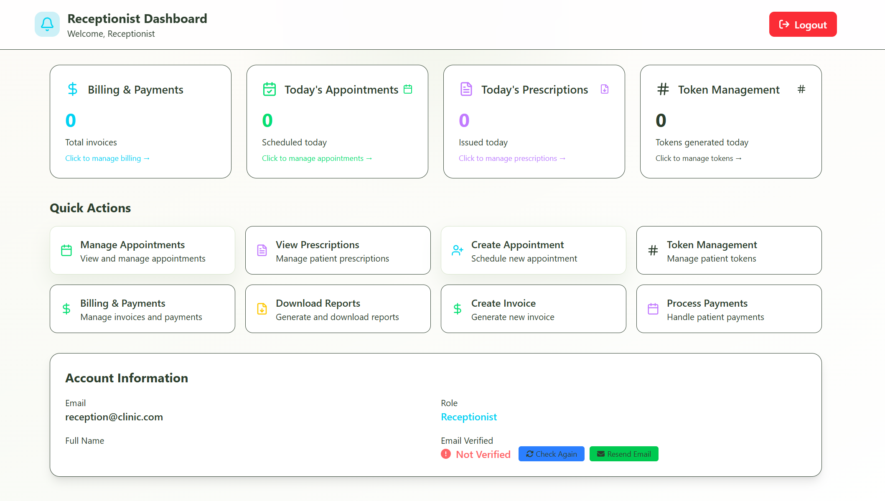

#  Clinic Management System


>  **Live Application**: [clinic-management-system-main3.vercel.app](https://clinic-management-system-main3.vercel.app)

A modern, secure, and feature-rich clinic management system built with React 19, Firebase, and Tailwind CSS. Streamline your healthcare operations with comprehensive patient management, appointment scheduling, prescription management, billing systems, and role-based access control.

##  Features

###  **Authentication & Security**
- **Firebase Authentication** with email/password
- **Email Verification** for account activation
- **Password Reset** functionality
- **Role-Based Access Control** (Doctor & Receptionist)
- **Protected Routes** for unauthorized access prevention
- **Secure Firestore Rules** for data protection

###  **Doctor Dashboard**
- **Real-time Statistics** (appointments, waiting patients, prescriptions)
- **Appointment Management** with patient details
- **Prescription Creation & Management**
- **Medicine Database** with search and filtering
- **Patient Queue Management** with token system
- **Prescription History** and editing capabilities

###  **Receptionist Dashboard**
- **Appointment Scheduling** and management
- **Token Management** system for patient queues
- **Patient Registration** and information management
- **Prescription Viewing** and management
- **Real-time Updates** across all systems

###  **Billing & Payment System**
- **Invoice Creation** with detailed itemization
- **Multiple Payment Methods** (Cash, Card, Online)
- **Payment Processing** and status tracking
- **Payment History** and reporting
- **PDF Generation** for invoices and prescriptions
- **Revenue Analytics** and financial reports

###  **Modern UI/UX**
- **Responsive Design** for all devices
- **Beautiful Gradients** and modern aesthetics
- **Real-time Updates** with Firebase listeners
- **Interactive Components** with smooth animations
- **Toast Notifications** for user feedback
- **Search & Filter** capabilities throughout

##  Live Demo

Experience the application live at: **[clinic-management-system-main3.vercel.app](https://clinic-management-system-main3.vercel.app)**

### Test Accounts

>  **IMPORTANT for Testing:** Use these credentials to access both dashboards. You do NOT need to create new accounts.

| Role | Email | Password |
|------|-------|----------|
| Doctor | demo@clinic.com | demo123 |
| Receptionist | reception@clinic.com | demo123 |

**Steps to login:**
1. Choose **Doctor** or **Receptionist** role
2. Copy the email and password from above
3. Click **Sign In**


| Feature | Preview |
|:--------:|:-------:|
| **Login Page** |  |
| **Doctor Dashboard** |  |
| **Receptionist Dashboard** |  |

##  Quick Start

### Prerequisites
- Node.js (v16 or higher)
- npm or yarn
- Firebase project

### 1. Clone and Install
```bash
git clone https://github.com/BashirAdam/clinic-management-system.git
cd clinic-management-system
npm install
```

### 2. Firebase Setup
1. Go to [Firebase Console](https://console.firebase.google.com/)
2. Create a new project or select existing one
3. Enable **Authentication** (Email/Password)
4. Enable **Firestore Database** (test mode)
5. Get your Firebase configuration

### 3. Environment Configuration
   ```bash
   cp env.example.txt .env
   ```

Update `.env` with your Firebase config:
   ```env
VITE_FIREBASE_API_KEY=your_api_key
   VITE_FIREBASE_AUTH_DOMAIN=your_project.firebaseapp.com
   VITE_FIREBASE_PROJECT_ID=your_project_id
   VITE_FIREBASE_STORAGE_BUCKET=your_project.appspot.com
   VITE_FIREBASE_MESSAGING_SENDER_ID=your_sender_id
   VITE_FIREBASE_APP_ID=your_app_id
   ```

### 4. Firebase Security Rules Configuration

**Important**: You must configure Firestore security rules to ensure proper data access control.

1. **Go to Firestore Database** in your Firebase Console
2. **Click on "Rules" tab**
3. **Replace the default rules** with the following:

```javascript
rules_version = '2';
service cloud.firestore {
  match /databases/{database}/documents {
    // Staff data access control
    match /staffData/{userId} {
      allow read, write: if request.auth != null && request.auth.uid == userId;
      allow create: if request.auth != null && request.auth.uid == userId;
    }
    
    // Appointments access control
    match /appointments/{document} {
      allow read: if request.auth != null;
      allow write: if request.auth != null && 
        (resource == null || resource.data.createdBy == request.auth.uid);
    }
    
    // Prescriptions access control
    match /prescriptions/{document} {
      allow read: if request.auth != null;
      allow write: if request.auth != null && 
        (resource == null || resource.data.doctorId == request.auth.uid);
    }
    
    // Medicines access control
    match /medicines/{document} {
      allow read: if request.auth != null;
      allow write: if request.auth != null;
    }
    
    // Invoices access control
    match /invoices/{document} {
      allow read: if request.auth != null;
      allow write: if request.auth != null && 
        (resource == null || resource.data.createdBy == request.auth.uid);
    }
  }
}
```

4. **Click "Publish"** to save the rules

**Why These Rules Matter:**
- **Security**: Prevents unauthorized access to sensitive data
- **Role-based Access**: Ensures users can only access their own data
- **Data Protection**: Protects patient information and medical records
- **Compliance**: Meets healthcare data security requirements

### 5. Run Development Server
```bash
npm run dev
```

Visit `http://localhost:5173` to see
##  Project Structure

```
src/
├── components/          # Reusable UI components
│   ├── LogoutButton.jsx
│   ├── ProtectedRoute.jsx
│   ├── EmailVerificationStatus.jsx
│   └── TokenDisplay.jsx
├── contexts/           # React context providers
│   └── AuthContext.jsx
├── firebase/           # Firebase configuration
│   └── config.js
├── hooks/              # Custom React hooks
│   └── useAuth.js
├── pages/              # Application pages
│   ├── auth/           # Authentication pages
│   │   ├── Login.jsx
│   │   ├── Signup.jsx
│   │   ├── ForgotPasswordForm.jsx
│   │   └── VerifyEmail.jsx
│   ├── doctor/         # Doctor-specific pages
│   │   ├── Doctor.jsx
│   │   ├── appointment/
│   │   ├── prescriptions/
│   │   └── token/
│   ├── receptionist/   # Receptionist-specific pages
│   │   ├── Receptionist.jsx
│   │   ├── appointment/
│   │   ├── billing/
│   │   ├── prescriptions/
│   │   └── token/
│   └── Home.jsx
├── utils/              # Utility functions
│   └── authUtils.js
├── App.jsx             # Main application component
└── main.jsx            # Application entry point
```

## 🔧 Available Scripts

| Command | Description |
|---------|-------------|
| `npm run dev` | Start development server |
| `npm run build` | Build for production |
| `npm run preview` | Preview production build |
| `npm run lint` | Run ESLint for code quality |

##  Deployment

This application is deployed on **Vercel** and is live at:
**[life-clinic-management-system.vercel.app](https://life-clinic-management-system.vercel.app)**


##  Security Features

- **Email verification** required for account activation
- **Role-based access control** with protected routes
- **Secure password reset** via email
- **Firestore security rules** for data protection
- **Authentication state management** with React Context
- **Protected API endpoints** and data access

##  Email Verification System

The system uses Firebase's built-in email verification:

1. **Automatic Email**: Sent when users sign up
2. **Verification Status**: Real-time display on dashboard
3. **Manual Refresh**: Users can check verification status
4. **Reliable System**: Direct integration with Firebase Auth

##  Tech Stack

### Frontend
- **React 19** - Modern React with latest features
- **Vite** - Fast build tool and development server
- **Tailwind CSS 4** - Utility-first CSS framework
- **React Router DOM** - Client-side routing
- **React Hot Toast** - Beautiful notifications
- **Lucide React** - Beautiful icons

### Backend & Database
- **Firebase Authentication** - User management
- **Firestore** - NoSQL cloud database
- **Firebase Security Rules** - Data access control

### Development Tools
- **ESLint** - Code quality and consistency
- **PostCSS** - CSS processing
- **Autoprefixer** - CSS vendor prefixing

##  Responsive Design

- **Mobile-first** approach
- **Tablet** and **desktop** optimized
- **Touch-friendly** interface
- **Cross-browser** compatibility

##  Real-time Features

- **Live Updates** with Firebase listeners
- **Real-time Statistics** on dashboards
- **Instant Notifications** for actions
- **Live Patient Queue** management

##  Data Management

- **Patient Records** with comprehensive information
- **Appointment Scheduling** with date/time management
- **Prescription Management** with medicine database
- **Billing System** with invoice generation
- **Token System** for patient queue management


## Author

**Bashir Adam Ahmed Ali**
- Student ID: 210208999
- Email: 210208999@ostimteknik.edu.tr
- GitHub: [@BashirAdam](https://github.com/BashirAdam)
- Live Demo: [clinic-management-system-main3.vercel.app](https://clinic-management-system-main3.vercel.app)
- University: OSTIM Technical University
- Course: WEX 428 - Workplace Experience III
- Term: Spring 2026


